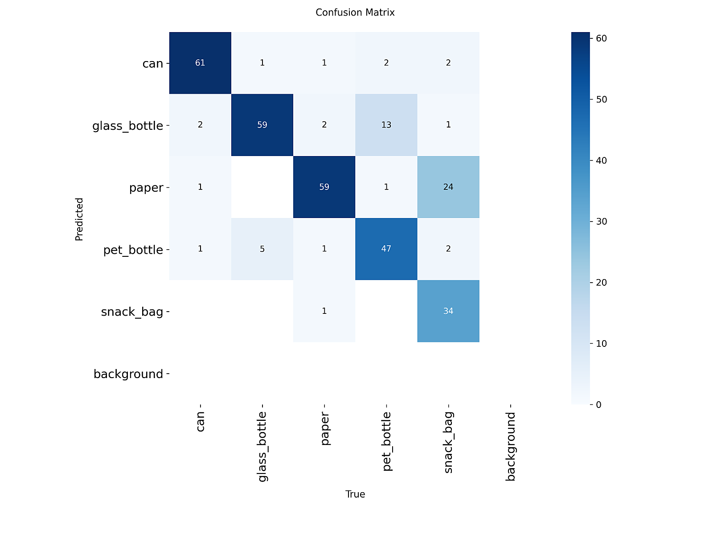
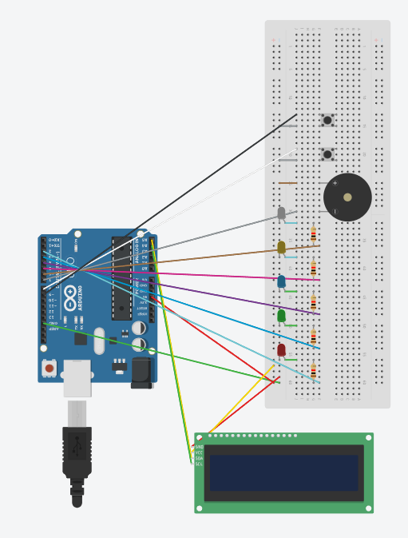

# 딥러닝 기반 생활 폐기물 자동 분류 시스템

> YOLOv8 Classification + FastAPI + Arduino IoT + Hand Gesture Control

<!-- 시연 GIF — ScreenToGif으로 녹화 후 아래 경로에 업로드 -->

---
.gif)
---
.gif)
---
.gif)
---
.gif)
---
.gif)
---
.gif)

---

---

## 📌 프로젝트 개요

AI 허브 실데이터를 기반으로 YOLOv8 분류 모델을 학습시키고,  
FastAPI 서버와 웹캠 클라이언트를 연동하여 실시간으로 생활 폐기물을 분류하는 시스템입니다.  
분류 결과는 Arduino LED·부저·LCD로 시각/청각 피드백을 제공하며,  
MediaPipe 손 제스처로 시스템을 제어할 수 있습니다.

| 항목 | 내용 |
|------|------|
| 분류 유형 | Image Classification (YOLOv8s-cls) |
| 분류 클래스 | 5종 (캔, 유리병, 종이, 페트병, 과자봉지) |
| Top-1 Accuracy | **78.8%** (Test set 80장 기준) |
| 개발 기간 | 2026.04.06 ~ 2026.04.11 (6일) |
| 개발 방식 | 개인 프로젝트 (1인) |

---

## 🏗️ 시스템 아키텍처

```
┌─────────────────────────────────────────────────────────────┐
│                        Client PC                            │
│                                                             │
│   step3_webcam.py         step7 (gesture control)          │
│   ┌──────────────┐        ┌─────────────────────┐          │
│   │  웹캠 캡처   │        │  MediaPipe 손 감지  │          │
│   │  Detection   │        │  START/PAUSE/FREEZE │          │
│   └──────┬───────┘        └──────────┬──────────┘          │
│          │ HTTP POST /detect_multi    │                      │
└──────────┼────────────────────────────┼─────────────────────┘
           │                            │
           ▼                            ▼
┌─────────────────────────────────────────────────────────────┐
│                     AI Server (FastAPI)                     │
│                   step5_api_server.py                       │
│                                                             │
│   /predict  /stats  /latest  /collected  /logs             │
│   YOLOv8s-cls 추론 → JSON 응답 → SQLite 로그 저장          │
│   collected_data/ 이미지 자동 수집 (피드백 루프)           │
└────────────────────────┬────────────────────────────────────┘
                         │ Serial (9600bps)
                         ▼
┌─────────────────────────────────────────────────────────────┐
│                   Arduino Uno                               │
│   LED ×5  부저  LCD I2C  버튼 ×2                           │
│   분류 결과 → LED 색상 점등 + LCD 표시 + 부저 알림         │
└─────────────────────────────────────────────────────────────┘
```

---

## 🗂️ 파일 구조

```
waste_classifier/
│
├── 📊 학습 파이프라인
│   ├── step1_preprocess.py     AI허브 데이터 샘플링·전처리
│   ├── step2_train.py          YOLOv8 기본 학습 (Colab)
│   ├── step2_train_v2.py       개선 학습 (small 모델, epoch 100)
│   └── step2_train_v3.py       최적화 학습 (augmentation 강화 + collected 병합)
│
├── 🖥️ 클라이언트
│   ├── step3_webcam.py         웹캠 Detection + 손 제스처 통합 클라이언트
│   └── step4_gradio_demo.py    Gradio 웹 데모 (포트폴리오용 공유 URL)
│
├── ⚙️ AI 서버
│   ├── step5_api_server.py     FastAPI 추론 서버 + SQLite 로그
│   ├── step6_dashboard.py      실시간 모니터링 대시보드 (port 8080)
│   └── dashboard.html          서버 대시보드 UI (localhost:8000)
│
├── 🤖 IoT
│   ├── step8_arduino.py        아두이노 Serial 통신 · LED 제어
│   └── arduino_led_lcd.ino     아두이노 펌웨어 (LED + LCD + 부저 + 버튼)
│
├── 🚀 실행 스크립트
│   ├── start_all.bat           전체 서비스 원클릭 실행 (Windows)
│   ├── stop_all.bat            전체 서비스 종료
│   └── restart_server.bat      AI 서버만 재시작
│
└── 📦 기타
    ├── best.pt                 학습된 모델 가중치
    ├── requirements.txt        패키지 의존성
    └── hand_landmarker.task    MediaPipe 손 감지 모델 (자동 다운로드)
```

---

## 🔧 기술 스택

| 구분 | 기술 |
|------|------|
| AI 모델 | YOLOv8s-cls (Ultralytics) — Transfer Learning |
| 손 제스처 | MediaPipe HandLandmarker (Google) |
| 객체 탐지 | YOLOv8n Detection (COCO → 폐기물 매핑) |
| API 서버 | FastAPI + Uvicorn |
| DB | SQLite (예측 로그 영구 저장) |
| 웹 데모 | Gradio |
| IoT | Arduino Uno + I2C LCD + 수동 부저 |
| 학습 환경 | Google Colab T4 GPU / Kaggle T4 GPU |
| 데이터셋 | AI Hub 생활 폐기물 이미지 |

---

## 🎯 분류 클래스

| ID | 클래스 | 한글명 | LED 색상 |
|----|--------|--------|----------|
| 0 | can | 캔/음료수캔 | 🔴 빨간 |
| 1 | glass_bottle | 유리병/음료수병 | ⚪ 흰색 |
| 2 | paper | 종이류/포장상자 | 🟢 초록 |
| 3 | pet_bottle | 페트병 | 🔵 파란 |
| 4 | snack_bag | 과자봉지/비닐 | 🟡 노란 |

---

## 📊 학습 결과

| 클래스 | 정확도 |
|--------|--------|
| can | 91% |
| snack_bag | 97% |
| glass_bottle | 76% |
| pet_bottle | 74% |
| paper | 70% |
| **전체 Top-1** | **78.8%** |

<!-- 아래 이미지는 runs/ 폴더에서 복사해서 assets/ 에 넣으세요 -->


---

## ✋ 손 제스처 제어

| 제스처 | 손가락 수 | 동작 |
|--------|-----------|------|
| ✋ 손 펼치기 | 5 | 분류 시작 |
| ✊ 주먹 | 0 | 분류 일시정지 |
| ☝ 검지 | 1 | 현재 프레임 캡처 저장 |
| ✌ 브이 | 2 | 화면 고정 (마지막 결과 유지) |

---

## 🔄 피드백 루프

```
1. 서비스 제공     YOLOv8 모델로 실시간 분류
        ↓
2. 데이터 수집     수신 이미지 → collected_data/{class}/ 자동 저장
        ↓
3. 기준 달성       /collected API → 클래스당 100장(총 500장) 달성 확인
        ↓
4. 재학습          step2_train_v3.py → collected_data 병합 → Colab 재학습
        ↓
5. 모델 갱신       best.pt 교체 → restart_server.bat 실행
        ↓
6. 서비스 개선     정확도 향상된 모델로 계속 서비스 제공
```

---

## 🚀 실행 방법

### 빠른 시작 (Windows)

```bash
# 1. 저장소 클론
git clone https://github.com/{username}/waste_classifier.git
cd waste_classifier

# 2. 가상환경 생성 및 패키지 설치
python -m venv .venv
.venv\Scripts\activate
pip install -r requirements.txt

# 3. 전체 실행 (더블클릭 또는 아래 명령)
start_all.bat
```

### 수동 실행 순서

```bash
# 터미널 1 — AI 서버 (가장 먼저)
python step5_api_server.py

# 터미널 2 — 웹캠 클라이언트
python step3_webcam.py

# 터미널 3 — 아두이노 연동 (선택)
python step8_arduino.py

# 터미널 4 — 모니터링 대시보드 (선택)
python step6_dashboard.py
```

### 접속 주소

| 서비스 | URL |
|--------|-----|
| AI 서버 + API 테스터 | http://localhost:8000 |
| 자동 API 문서 | http://localhost:8000/docs |
| 모니터링 대시보드 | http://localhost:8080 |

---

## 📡 API 엔드포인트

| Method | 경로 | 설명 |
|--------|------|------|
| GET | `/health` | 헬스체크 |
| POST | `/predict` | 이미지 → 폐기물 분류 |
| GET | `/stats` | 서버 통계 |
| GET | `/latest` | 최신 감지 결과 (아두이노용) |
| POST | `/detect_multi` | 다중 감지 결과 등록 |
| GET | `/collected` | 수집 데이터 현황 |
| GET | `/logs` | 예측 로그 조회 (SQLite) |
| GET | `/logs/summary` | 로그 통계 요약 |
| POST | `/webcam/pause` | 분류 일시정지 |
| POST | `/webcam/resume` | 분류 재개 |
| POST | `/webcam/capture` | 캡처 저장 요청 |

---

## 🔌 아두이노 핀 연결

```
[LED - 220Ω 저항 직렬]       [LCD I2C V2]
D2 → 빨간 LED (캔)           A4 (SDA) → LCD SDA
D3 → 초록 LED (종이)         A5 (SCL) → LCD SCL
D4 → 파란 LED (페트병)       5V       → LCD VCC
D5 → 노란 LED (과자봉지)     GND      → LCD GND
D6 → 흰색 LED (유리병)

[수동 부저]    [버튼 - 내부 풀업]
D7 → 부저     D8 → 버튼1 (캡처 저장)
              D9 → 버튼2 (일시정지/재개)
```

---

## 🏋️ 모델 재학습 방법

```bash
# 1. dataset/ 폴더를 Google Drive에 업로드
# 2. Colab에서 아래 실행

!pip install ultralytics
from google.colab import drive
drive.mount('/content/drive')

# step2_train_v3.py 실행
# → collected_data 자동 병합 + 학습 + best.pt 다운로드
```

---

## 📁 데이터셋 구조

```
dataset/
├── train/    (6,000장 — 클래스당 1,200장)
│   ├── can/
│   ├── glass_bottle/
│   ├── paper/
│   ├── pet_bottle/
│   └── snack_bag/
├── val/      (320장)
└── test/     (80장)
```

출처: [AI Hub 생활 폐기물 이미지](https://www.aihub.or.kr/)

---

## 📜 요구사항 달성 현황

- [x] 실데이터 수집·전처리·학습·배포 Full-Cycle
- [x] YOLOv8 Transfer Learning & Fine-tuning
- [x] Top-1 Accuracy 70% 이상 달성 (78.8%)
- [x] FastAPI AI 서버 + 웹캠 클라이언트 TCP/IP 연동
- [x] 피드백 루프 설계 (데이터 수집 → 재학습 → 서비스 개선)
- [x] 추가 어플리케이션 구현 (Arduino IoT + 손 제스처)
- [x] 두 번째 AI 모델 (MediaPipe HandLandmarker)
- [x] Gradio 웹 데모 배포

---

## 👤 개발자

| 항목    | 내용         |
|-------|------------|
| 이름    | 김범준        |
| 과정    | LMS8차      |
| 제출일   | 2026.04.11 |
| 지도 교수 | 이동녘 교수님    |
